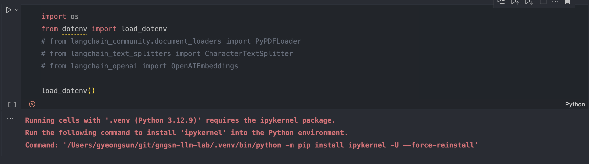

## 1. 

```bash
❯ poetry add langchain-google-genai
Using version ^2.0.11 for langchain-google-genai

Updating dependencies
Resolving dependencies... (0.0s)

The current project's supported Python range (>=3.12) is not compatible with some of the required packages Python requirement:
  - langchain-google-genai requires Python <4.0,>=3.9, so it will not be installable for Python >=4.0

Because no versions of langchain-google-genai match >2.0.11,<3.0.0
 and langchain-google-genai (2.0.11) requires Python <4.0,>=3.9, langchain-google-genai is forbidden.
So, because gngsn-llm-lab depends on langchain-google-genai (^2.0.11), version solving failed.

  * Check your dependencies Python requirement: The Python requirement can be specified via the `python` or `markers` properties

    For langchain-google-genai, a possible solution would be to set the `python` property to ">=3.12,<4.0"

    https://python-poetry.org/docs/dependency-specification/#python-restricted-dependencies,
    https://python-poetry.org/docs/dependency-specification/#using-environment-markers
```

Python 버전이 `<4.0` 임을 명시해줘야 함

```toml
...

[tool.poetry.dependencies]
python = ">=3.12,<4.0"

...
```

이후 다시 설치

```bash
❯ poetry add langchain-google-genai
Using version ^2.0.11 for langchain-google-genai

Updating dependencies
Resolving dependencies... (2.3s)

Package operations: 38 installs, 0 updates, 0 removals
```

<br/>

## 2. ipynb 실행 오류



```bash
Running cells with '-venv (Python 3.12.9)' requires the ipykernel package.
Run the following command to install 'ipykernel' into the Python environment.
Command: '/Users/gyeongsun/git/gngsn-llm-lab/.venv/bin/python -m pip install ipykernel -U --force-reinstall'
```

위와 같은 오류 발생 시, `ipykernel` 수동 설치

```bash
❯ pip install ipykernel
```